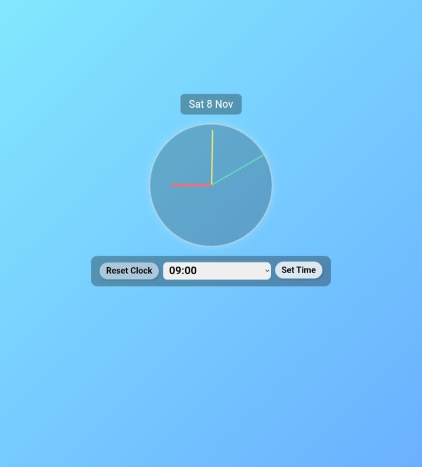

# Analog Clock

A simple analog clock built with **HTML**, **CSS**, and **JavaScript**.  
Displays the current time with hour, minute, and second hands, and also shows the current date.

---

## **Live Demo**

Check out the live version here:  
[Analog Clock on Netlify](https://690f6bd1f7e815671839d7e7--friendly-starship-392a9d.netlify.app/)

---

## Screenshot




## **Features**

- Real-time analog clock
- Shows current date
- Reset and set custom time
- Fully responsive design
- Color-coded hour, minute, and second hands

---

## **Technologies Used**

- HTML
- CSS
- JavaScript

---

## **How to Run Locally**

1. Clone the repository:
   ```bash
   git clone https://github.com/sowjanya123-cpu/Analog_Clock.git
